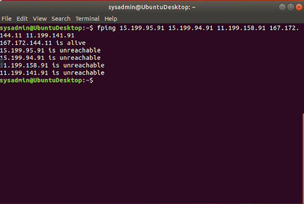
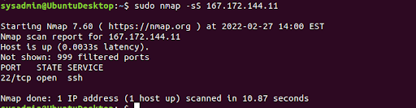
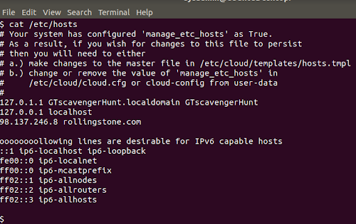
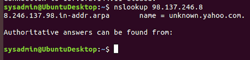
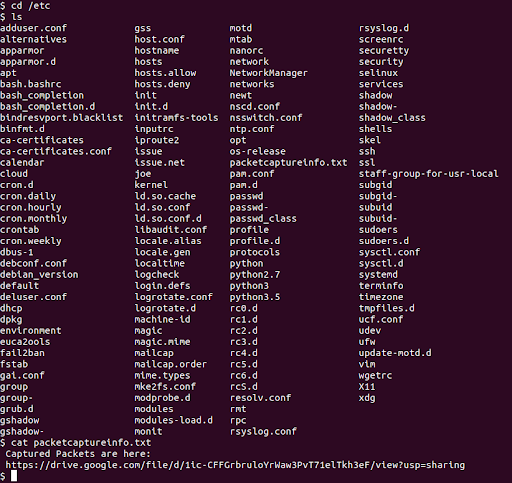
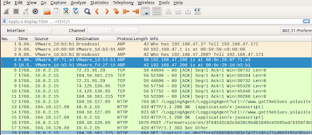
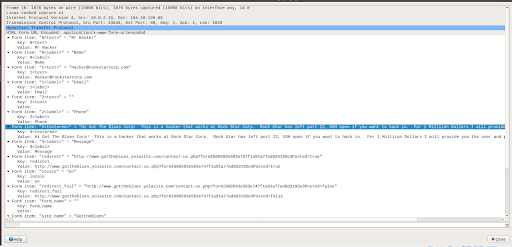

## Networking Fundamentals Homework: Rocking your Network!

You have just been hired by RockStar Corporation as a network security analyst.

- RockStar Corp has recently built a new office in Hollywood, California. You are tasked with completing a **network vulnerability assessment** of the office.

- You will complete several steps in order to analyze the Hollywood network and then provide RockStar Corp a summary of your findings.

- RockStar Corp is also concerned that a hacker may have infiltrated their Hollywood office. You will need to determine if there is anything suspicious in your findings.

### Files Required

RockStar Corp has provided you with:

- A list of their network assets: [Rock Star Server List](resources/Rockstarserverlist.xlsx)
- Instructions to scan their network.

### Your Goal

You will follow instructions to work through four phases of the network assessment. For each phase, include the following:

- The steps and commands used to complete the tasks.

- A summary of your findings for each testing phase.

- Any network vulnerabilities discovered.

- Findings associated with a hacker.

- Recommended mitigation strategy.

- Document the OSI layer where the findings were found.


### Topics Covered in Your Assignment

- Subnetting
- CIDR
- IP Addresses
- `fping`
- OSI Model and OSI Layers
- Protocols
- Ports
- Wireshark
- PCAP Analysis
- `DNS`
- `HTTP`
- `ARP`
- `Syn` Scan
- `TCP`
- `nslookup`
- Network Vulnerability Assessments
- Network Vulnerability Mitigation

---

### Network Vulnerability Assessment Instructions

Please note that you will be using your Vagrant virtual machine for this homework.

### **Phase 1**: _"I'd like to Teach the World to `Ping`"_

You have been provided a list of network assets belonging to RockStar Corp. Use `fping` to ping the network assets for only the Hollywood office.

  - Determine the IPs for the Hollywood office and run `fping` against the IP ranges in order to determine which IP is accepting connections.

  - RockStar Corp doesn't want any of their servers, even if they are up, indicating that they are accepting connections.
     - Use `fping <IP Address>` and ignore any results that say "Request timed out".
     - If any of the IP addresses send back a Reply, enter Ctrl+C to stop sending requests.

  - Create a summary file in a word document that lists out the `fping` command used, as well as a summary of the results.

  - Your summary should determine which IPs are accepting connections and which are not.

  - Also indicate at which OSI layer your findings are found.

## **Phase 1: Solutions**
  *List the steps and commands used to complete the tasks.*
    ```bash
    $ fping 15.199.95.91 15.199.94.91 11.199.158.91 167.172.144.11 11.199.141.91
    ```

  *List any vulnerabilities discovered.*
    ***167.172.144.11 is reachable***
  *List any findings associated with a hacker.*
    ***RockStar Corp doesn’t want any of their servers to be reachable even if they are up, 167.172.144.11 being reachable up means a hacker would be able to connect to it.***
  *Document the mitigation recommendations to protect against the discovered vulnerabilities.*
    ***Disable the ability to ping 167.172.144.11***
  *Document the OSI layer where the findings were found.*
    ***Layer 3: Network Layer***
    ***Pings work through the use of ICMP services and IP addresses which are found in the the Network Layer of the OSI Model***

### **Phase 2**:  _"Some `Syn` for Nothin`"_

With the IP(s) found from Phase 1, determine which ports are open:

  - You will run a `SYN SCAN` against the IP accepting connections. See **SYN SCAN Instructions** below.

  - Using the results of the `SYN SCAN`, determine which ports are accepting connections.

  - Add these findings to the summary and be sure to indicate at which OSI layer your findings were found.

#### `SYN SCAN`  Instructions

What is **Nmap**?

  - **Nmap** is a free networking scanning tool available for Linux distributions.

  - Security professionals use Nmap to determine the devices running on a network, as well as finding open ports to determine potential security vulnerabilities.

  - Nmap has many capabilities and commands that can be run. Here is a cheat sheet for reference:  https://www.stationx.net/nmap-cheat-sheet/.

For this activity, we will specifically focus on the Nmap capability of running a SYN SCAN.

  - We have already covered that a SYN SCAN is an automated method to check for the states of ports on a network, Nmap is simply a tool that can automate this task.

To run a SYN SCAN:

  - Open up the terminal within your Linux machine.

  - The command to run a SYN SCAN is `nmap -sS  <IP Address>`.

    - For example, if you wanted to run a SYN SCAN against the server IP of `74.207.244.221`, you would run `nmap -sS 74.207.244.221` and press enter.

    - This will scan the most common 1000 ports.

  - After this runs for several minutes, it should return a similar result that depicts the state of the ports on that server:

        Starting Nmap 7.70 ( https://nmap.org ) at 2019-08-14 11:51 EDT
        Nmap scan report for li86-221.members.linode.com (74.207.244.221)
        Host is up (1.4s latency).
        Not shown: 988 closed ports
        PORT    STATE    SERVICE
        22/tcp  open     ssh
        25/tcp  filtered smtp
        110/tcp open     pop3
        113/tcp filtered ident
        135/tcp filtered msrpc
        139/tcp filtered netbios-ssn
        143/tcp open     imap
        445/tcp filtered microsoft-ds
        465/tcp open     smtps
        587/tcp open     submission
        993/tcp open     imaps
        995/tcp open     pop3s

  - The results show the port number / TCP / UDP , the state of the port, and the service / protocol for the ports that are either open or filtered (stopped by a firewall).

  - Closed ports are not shown, indicated on the line:  `Not shown: 988 closed ports`.

  - For the purpose of this exercise, document which ports are open on the RockStar Corp server, and which OSI layer SYN scans run on.

## **Phase 2: Solutions**
  *List the steps and commands used to complete the tasks.*
    ```bash
    $ sudo nmap -sS 167.172.144.11
    ```

  *List any vulnerabilities discovered.*
    ***Port 22 are accepting connections***
  *Document the mitigation recommendations to protect against the discovered vulnerabilities.*
    ***Close port 22 so that no one is able to connect to it***
  *Document the OSI layer where the findings were found.*
    ***Layer 4 Transport Layer***
    ***The syn scan uses TCP which is part of the transport layer of the OSI model***

### Phase 3: _"I Feel a `DNS` Change Comin' On"_

With your findings from Phase 2, determine if you can access the server that is accepting connections.

- RockStar typically uses the same default username and password for most of their servers, so try this first:

  - **Username:**   `jimi`

  - **Password:**   `hendrix`

- Try to figure out which port/service would be used for remote system administration, and then using these credentials, attempt to log into the IP that responded to pings from **Phase 1**.

RockStar Corp recently reported that they are unable to access `rollingstone.com` in the Hollywood office. Sometimes when they try to access the website, a different, unusual website comes up.

  - While logged into the RockStar server from the previous step, determine if something was modified on this system that might affect viewing `rollingstone.com` within the browser. When you successfully find the configuration file, record the entry that is set to `rollingstone.com`.

  - Terminate your ssh session to the rollingstone server, and use `nslookup` to determine the real domain of the IP address you found from the previous step.

    - **Note**: **nslookup** is a command line utility that can work in Windows or Linux Systems. It is designed to query Domain Name System records. You can use PowerShell or  MacOS/Linux terminal to run `nslookup`.

    - To run **nslookup**, simply enter the following on the command line:

      `nslookup <IP Address>` to find the domain associated to an IP address

      OR

      `nslookup <domain name>` to find the IP address associated to a domain

    - You'll know you found the right domain if it begins with `unknown.`.

  - Add your findings to your summary and be sure to indicate which OSI layer they were found on.

## **Phase 3: Solutions**
  *List the steps and commands used to complete the tasks.*
  ```bash
  $ ssh jimi@167.172.144.11
  $ password: hendrix
  $ cat /etc/hosts
  $ nslookup 98.137.246.8
  ```


  *List any vulnerabilities discovered.*
    ***The IP address associated with rollingstone.com website is unknown.yahoo.com. If someone were to try to access rollingstone.com then they will be redirected to unknown.yahoo.com. instead.*** 
  *Document the mitigation recommendations to protect against the discovered vulnerabilities.*
    ***To remove the ip address and website from the hosts file***
      sudo nano hosts
    ***Host file sanitation and monitoring regularly***
  *Document the OSI layer where the findings were found.*
    ***Layer 7 Application***
      ***/etc/host file deals with DNS which is part of the Application Layer of the OSI Model***


 ### Phase 4:  _"Sh`ARP` Dressed Man"_

Within the RockStar server that you SSH'd into, and in the same directory as the configuration file from **Phase 3**, the hacker left a note as to where he stored away some packet captures.  

- View the file to find where to recover the packet captures.

- These are packets that were captured from the activity in the Hollywood Office.

- Use Wireshark to analyze this pcap file and determine if there was any suspicious activity that could be attributed to a hacker.

  - **Hint**: Focus on the ARP and HTTP protocols. Recall the different types of HTTP request methods and be sure to thoroughly examine the contents of these packets.

- Add your findings in your summary and be sure to indicate at which OSI layer they were found.

## **Phase 4: Solutions**
  *List the steps and commands used to complete the tasks.*
    ```bash
    $ ssh jimi@167.172.144.11
    $ cd /etc
    $ cat packetcaptureinfo.txt #Open link: https://drive.google.com/file/d/1ic-CFFGrbruloYrWaw3PvT71elTkh3eF/view?usp=sharing
    ```



  *List any vulnerabilities discovered.*
    ***ARP Filters:***
      ***ARP spoofing attack***
      ***Line 4 and Line 5 show two different MAC addresses for the request of who is at 192.168.47.200?***
  *List any findings associated with a hacker.*
    ***HTTP Filters: Hacker has posted about a vulnerability on the website.***
  *Document the mitigation recommendations to protect against the discovered vulnerabilities.*
    ***Static entry on ARP table***
    ***Ids and ips network hardware***
  *Document the OSI layer where the findings were found.*
    ***Layer 2: Data Link***
      ***The ARP filters involves the use of MAC addresses which is part of the Data Link layer***
    ***Layer 7: Application***
      ***The HTTP filter involves DNS which is part of the Application Layer***

---

© 2020 Trilogy Education Services, a 2U, Inc. brand. All Rights Reserved.
