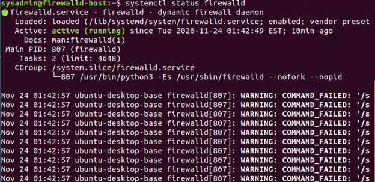

## Unit 11 Submission File: Network Security Homework 

### Part 1: Review Questions 

#### Security Control Types

The concept of defense in depth can be broken down into three different security control types. Identify the security control type of each set  of defense tactics.

1. Walls, bollards, fences, guard dogs, cameras, and lighting are what type of security control?

    Answer: ***Physical access controls***

2. Security awareness programs, BYOD policies, and ethical hiring practices are what type of security control?

    Answer: ***Administrative controls***

3. Encryption, biometric fingerprint readers, firewalls, endpoint security, and intrusion detection systems are what type of security control?

    Answer: ***Technical Control***

#### Intrusion Detection and Attack indicators

1. What's the difference between an IDS and an IPS?

    Answer: ***An Intrusion Detection System (IDS) is a passive application that detects and alerts of an attack. An IDS logs and documents information for future analysis and requires action by an administrator. An Intrusion Prevention System (IPS) detects an attack and then takes action and responds to the attack.***
    ***An IDS employs either a Network TAP or a SPAN to collect data from the network via a switch and an IPS connects inline with the data flow between the firewall and a network switch***

2. What's the difference between an Indicator of Attack and an Indicator of Compromise?

   Answer: ***An Indicator of Attack (IOA) signals that an attack is happening in real time but a full breach has not been determined. IOAs reveal the end goal of an attacker regardless of the exploit or malware being used.***
   ***An Indicator of Compromise (IOC) indicates previous malicious activity and signifies a full breach. IOCs establish the attacker's techniques, tactics, and procedures and expose the vulnerabilities used in an attack allowing the opportunity to revamp defenses and mitigation strategies.***

#### The Cyber Kill Chain

Name each of the seven stages for the Cyber Kill chain and provide a brief example of each.

1. Stage 1: ***Reconnaissance*** - *Researching, identifying, and selecting targets. Email, social network accounts, conference attendance, professional memberships are common sources of information.*

2. Stage 2: ***Weaponization*** - *Creating or re-engineering malware and pairing it with an exploit into a deliverable payload. This would be embedding code into PDFs, MS Office files, websites, etc.*

3. Stage 3: ***Delivery*** - *Getting the payload to the victim or target. Common vectors are email attachments, websites, and USB drives.*

4. Stage 4: ***Exploitation*** - *Triggering or activating payload to take advantage of vulnerable applications or systems.*

5. Stage 5: ***Installation*** - *The malware is installed and creates a backdoor on the target system permitting persistent access*

6. Stage 6: ***Command and Control*** - *The backdoor that was established allows the attacker to navigate the network and carry out their objectives remotely.*

7. Stage 7: ***Action on Objectives*** - *Attackers carry out their goals on their target by collecting and exfiltrating information from the victim.*


#### Snort Rule Analysis

Use the Snort rule to answer the following questions:

Snort Rule #1

```bash
alert tcp $EXTERNAL_NET any -> $HOME_NET 5800:5820 (msg:"ET SCAN Potential VNC Scan 5800-5820"; flags:S,12; threshold: type both, track by_src, count 5, seconds 60; reference:url,doc.emergingthreats.net/2002910; classtype:attempted-recon; sid:2002910; rev:5; metadata:created_at 2010_07_30, updated_at 2010_07_30;)
```

1. Break down the Sort Rule header and explain what is happening.

   Answer: ***Snort is will alert for a reconnaissance SYN scan on the port range 5800 - 5820 coming from outside the home network.***

2. What stage of the Cyber Kill Chain does this alert violate?

   Answer: ***This violates the first stage, Reconnaissance, of the Cyber Kill Chain.***

3. What kind of attack is indicated?

   Answer: ***A port scanning attack (SYN scan) is the indicated attack.***

Snort Rule #2

```bash
alert tcp $EXTERNAL_NET $HTTP_PORTS -> $HOME_NET any (msg:"ET POLICY PE EXE or DLL Windows file download HTTP"; flow:established,to_client; flowbits:isnotset,ET.http.binary; flowbits:isnotset,ET.INFO.WindowsUpdate; file_data; content:"MZ"; within:2; byte_jump:4,58,relative,little; content:"PE|00 00|"; distance:-64; within:4; flowbits:set,ET.http.binary; metadata: former_category POLICY; reference:url,doc.emergingthreats.net/bin/view/Main/2018959; classtype:policy-violation; sid:2018959; rev:4; metadata:created_at 2014_08_19, updated_at 2017_02_01;)
```

1. Break down the Sort Rule header and explain what is happening.

   Answer: ***The Snort rule is alerting to executable files or Dynamic Link Libraries being downloaded from the internet to the home network.***

2. What layer of the Defense in Depth model does this alert violate?

   Answer: ***This alert violates the Host layer of the Defense In Depth Model***

3. What kind of attack is indicated?

   Answer: ***Command and Control malware, a worm, a Trojan, or a virus***

Snort Rule #3

- Your turn! Write a Snort rule that alerts when traffic is detected inbound on port 4444 to the local network on any port. Be sure to include the `msg` in the Rule Option.

    Answer:
```bash
alert tcp $EXTERNAL_NET any -> $HOME_NET 4444 (msg:"Potential malware intrusion on port 4444"; flow: established, to client; classtype: intrusion; reference: url, Port 4444 (tcp/udp) :: SpeedGuide; rev:1;)
```

### Part 2: "Drop Zone" Lab

#### Log into the Azure `firewalld` machine

Log in using the following credentials:

- Username: `sysadmin`
- Password: `cybersecurity`

#### Uninstall `ufw`

Before getting started, you should verify that you do not have any instances of `ufw` running. This will avoid conflicts with your `firewalld` service. This also ensures that `firewalld` will be your default firewall.

- Run the command that removes any running instance of `ufw`.

    ```bash
    $ sudo ufw status #check ufw status
    $ sudo apt-get remove -auto-remove ufw
    ```

#### Enable and start `firewalld`

By default, these service should be running. If not, then run the following commands:

- Run the commands that enable and start `firewalld` upon boots and reboots.

    ```bash
    $ sudo systemctl enable firewalld
    $ sudo /etc/init.d/firewalld start
    ```

  Note: This will ensure that `firewalld` remains active after each reboot.

#### Confirm that the service is running.

- Run the command that checks whether or not the `firewalld` service is up and running.

    ```bash
    $ systemctl status firewalld
    ```


#### List all firewall rules currently configured.

Next, lists all currently configured firewall rules. This will give you a good idea of what's currently configured and save you time in the long run by not doing double work.

- Run the command that lists all currently configured firewall rules:

    ```bash
    $ firewall-cmd --list-all-zones
    ```

- Take note of what Zones and settings are configured. You many need to remove unneeded services and settings.

#### List all supported service types that can be enabled.

- Run the command that lists all currently supported services to see if the service you need is available

    ```bash
    $ firewallctl list services
    ```

- We can see that the `Home` and `Drop` Zones are created by default.


#### Zone Views

- Run the command that lists all currently configured zones.

    ```bash
    $ firewallctl list zones
    ```


- We can see that the `Public` and `Drop` Zones are created by default. Therefore, we will need to create Zones for `Web`, `Sales`, and `Mail`.

#### Create Zones for `Web`, `Sales` and `Mail`.

- Run the commands that creates Web, Sales and Mail zones.

    ```bash
    $ firewallctl new -p zone -n Web
    $ firewallctl new -p zone -n Sales
    $ firewallctl new -p zone -n Mail
    ```

#### Set the zones to their designated interfaces:

- Run the commands that sets your `eth` interfaces to your zones.

    ```bash
    $ sudo firewall-cmd --zone=public --change-interface=ETH0
    $ sudo firewall-cmd --zone=Web --change-interface=ETH1
    $ sudo firewall-cmd --zone=Sales --change-interface=ETH2
    $ sudo firewall-cmd --zone=Mail --change-interface=ETH3
    ```

#### Add services to the active zones:

- Run the commands that add services to the **public** zone, the **web** zone, the **sales** zone, and the **mail** zone.

- Public:

    ```bash
    $ sudo firewall-cmd --zone=public --add-service=http
    $ sudo firewall-cmd --zone=public --add-service=https
    $ sudo firewall-cmd --zone=public --add-service=pop3
    $ sudo firewall-cmd --zone=public --add-service=smtp
    ```

- Web:

    ```bash
    $ sudo firewall-cmd --zone=Web --add-service=http
    ```

- Sales

    ```bash
    $ sudo firewall-cmd --zone=Sales --add-service=https
    ```

- Mail

    ```bash
    $ sudo firewall-cmd --zone=Mail --add-service=smtp
    $ sudo firewall-cmd --zone=Mail --add-service=pop3
    ```

- What is the status of `http`, `https`, `smtp` and `pop3`?
    ***http is active on the public and Web zones***
    ***https is active on the public and Sales zones***
    ***smtp is active on the public and Mail zones***
    ***pop3 is active on the public and Mail zones***


#### Add your adversaries to the Drop Zone.

- Run the command that will add all current and any future blacklisted IPs to the Drop Zone.

     ```bash
    $ sudo firewall-cmd -zone=drop -add-rich-rule='rule family="ipv4" source address="10.208.56.23" reject'
    $ sudo firewall-cmd -zone=drop -add-rich-rule='rule family="ipv4" source address="135.95.103.76" reject'
    $ sudo firewall-cmd -zone=drop -add-rich-rule='rule family="ipv4" source address="76.34.169.118" reject'
    ```

#### Make rules permanent then reload them:

It's good practice to ensure that your `firewalld` installation remains nailed up and retains its services across reboots. This ensure that the network remains secured after unplanned outages such as power failures.

- Run the command that reloads the `firewalld` configurations and writes it to memory

    ```bash
    $ sudo firewall-cmd --runtime-to-permanent
    $ service firewalld restart
    ```

#### View active Zones

Now, we'll want to provide truncated listings of all currently **active** zones. This a good time to verify your zone settings.

- Run the command that displays all zone services.

    ```bash
    $ firewall-cmd --get-active-zones
    ```


#### Block an IP address

- Use a rich-rule that blocks the IP address `138.138.0.3`.

    ```bash
    $ sudo firewall-cmd --zone=drop --add-rich-rule='rule family="ipv4" source address="138.138.0.3" reject'
    ```

#### Block Ping/ICMP Requests

Harden your network against `ping` scans by blocking `icmp ehco` replies.

- Run the command that blocks `pings` and `icmp` requests in your `public` zone.

    ```bash
    $ firewall-cmd --zone=public --add-icmp-block=echo-reply --add-icmp-block=echo-request
    ```

#### Rule Check

Now that you've set up your brand new `firewalld` installation, it's time to verify that all of the settings have taken effect.

- Run the command that lists all  of the rule settings. Do one command at a time for each zone.

    ```bash
    $ sudo firewall-cmd --zone=public --list-all
    $ sudo firewall-cmd --zone=Web --list-all
    $ sudo firewall-cmd --zone=Sales --list-all
    $ sudo firewall-cmd --zone=Mail --list-all
    $ sudo firewall-cmd --zone=drop --list-all
    ```

- Are all of our rules in place? If not, then go back and make the necessary modifications before checking again.


Congratulations! You have successfully configured and deployed a fully comprehensive `firewalld` installation.

---

### Part 3: IDS, IPS, DiD and Firewalls

Now, we will work on another lab. Before you start, complete the following review questions.

#### IDS vs. IPS Systems

1. Name and define two ways an IDS connects to a network.

   Answer 1:***Switched Port Analyzer (SPAN)*** - *or port mirroring sends a mirror image of all network data to another physical port for packets to be captured and analyzed.*

   Answer 2:***Network TAP*** - *provides access to a network to transmit both inbound and outbound data streams simultaneously on different channels allowing data to arrive at the monitoring device in real time.*

2. Describe how an IPS connects to a network.

   Answer:***An IPS connects to a network inline with the data stream between the firewall and the network switch.***

3. What type of IDS compares patterns of traffic to predefined signatures and is unable to detect Zero-Day attacks?

   Answer:***Signature-based IDS***

4. Which type of IDS is beneficial for detecting all suspicious traffic that deviates from the well-known baseline and is excellent at detecting when an attacker probes or sweeps a network?

   Answer:***Anomaly-based IDS***

#### Defense in Depth

1.	For each of the following scenarios, provide the layer of Defense in Depth that applies:
    1.	A criminal hacker tailgates an employee through an exterior door into a secured facility, explaining that they forgot their badge at home.
       Answer: ***Perimeter***
    2.	A zero-day goes undetected by antivirus software.
        Answer: ***Application***
    3.	A criminal successfully gains access to HR's database.
        Answer: ***Data***
    4.	A criminal hacker exploits a vulnerability within an operating system.
        Answer: ***Host***
    5.	A hacktivist organization successfully performs a DDoS attack, taking down a government website.
        Answer: ***Network***
    6.	Data is classified at the wrong classification level.
        Answer: ***Data***
    7.	A state sponsored hacker group successfully firewalked an organization to produce a list of active services on an email server.
        Answer: ***Network***
2.	Name one method of protecting data-at-rest from being readable on hard drive.
    Answer: ***Encryption with a strong algorithm such as RSA.***
3.	Name one method to protect data-in-transit.
    Answer: ***Encryption using HTTPS, SFTP, SSL***
4.	What technology could provide law enforcement with the ability to track and recover a stolen laptop.
    Answer: ***Software/Application***
5.	How could you prevent an attacker from booting a stolen laptop using an external hard drive?
    Answer: ***Disable USB/Firewire ports in the BIOS***

#### Firewall Architectures and Methodologies

1.	Which type of firewall verifies the three-way TCP handshake? TCP handshake checks are designed to ensure that session packets are from legitimate sources.
    Answer: ***Circuit-level firewall***
2.	Which type of firewall considers the connection as a whole? Meaning, instead of looking at only individual packets, these firewalls look at whole streams of packets at one time.
    Answer: ***Stateful Packet-Filtering Firewalls***
3.	Which type of firewall intercepts all traffic prior to being forwarded to its final destination. In a sense, these firewalls act on behalf of the recipient by ensuring the traffic is safe prior to forwarding it?
    Answer: ***Network firewall***
4.	Which type of firewall examines data within a packet as it progresses through a network interface by examining source and destination IP address, port number, and packet type- all without opening the packet to inspect its contents?
    Answer: ***Stateless Packet-Filtering Firewall***
5.	Which type of firewall filters based solely on source and destination MAC address?
    Answer: ***MAC Layer Firewall***

### Bonus Lab: "Green Eggs & SPAM"
In this activity, you will target spam, uncover its whereabouts, and attempt to discover the intent of the attacker.
 
- You will assume the role of a Jr. Security administrator working for the Department of Technology for the State of California.
 
- As a junior administrator, your primary role is to perform the initial triage of alert data: the initial investigation and analysis followed by an escalation of high priority alerts to senior incident handlers for further review.
 
- You will work as part of a Computer and Incident Response Team (CIRT), responsible for compiling **Threat Intelligence** as part of your incident report.

#### Threat Intelligence Card

**Note**: Log into the Security Onion VM and use the following **Indicator of Attack** to complete this portion of the homework. 

Locate the following Indicator of Attack in Sguil based off of the following:

- **Source IP/Port**: `188.124.9.56:80`
- **Destination Address/Port**: `192.168.3.35:1035`
- **Event Message**: `ET TROJAN JS/Nemucod.M.gen downloading EXE payload`

Answer the following:

1. What was the indicator of an attack?
   - Hint: What do the details of the reveal? 

    Answer: ***ET TROJAN JS/Nemucod.M.gen downloading EXE payload indicates that a executable trojan was downloaded.***


2. What was the adversarial motivation (purpose of attack)?

    Answer: ***The purpose of the attack was to steal credentials through the deployment of a command and control trojan obfuscated in java script payload in documents containing VBA macros as email attachments. It targets credentials in protected storage (Pstore), credential cache, Windows Vault, browsers, email clients, stores them in a text file in %TEMP%\goga.txt to exfiltrate using an HTTP POST request pretending to be from a Windows 7 OS.***

3. Describe observations and indicators that may be related to the perpetrators of the intrusion. Categorize your insights according to the appropriate stage of the cyber kill chain, as structured in the following table.

| TTP | Example | Findings |
| --- | --- | --- | 
| **Reconnaissance** |  How did they attacker locate the victim? | Phishing spam campaign in professional, tech, financial, energy, and healthcare sectors |
| **Weaponization** |  What was it that was downloaded?| Spam emails with .zip extensions containing malicious Java Script |
| **Delivery** |    How was it downloaded?| Email |
| **Exploitation** |  What does the exploit do?| Installs a JS downloader that runs when the JS in the attachment is activated by the recipient. The default browser will then run the code, without consent, and will download additional malware.  It gathers credentials and exfiltrates them. |
| **Installation** | How is the exploit installed?| Installed by opening weaponized documents |
| **Command & Control (C2)** | How does the attacker gain control of the remote machine?| Establishes calls with a destination server acting as an HTTP POST command from Windows 7/Mozilla |
| **Actions on Objectives** | What does the software that the attacker sent do to complete it's tasks?| Collects credentials from protected storage (Pstore), credential cache, Windows Vault, browsers, email clients, stores them in a text file in %TEMP%\goga.txt to exfiltrate to attacker. |


4. What are your recommended mitigation strategies?


    Answer: ***Do not open emails from unknown senders. Never open attachments or click on links in emails from unknown senders. Never respond to spam emails. Report emails, files, and emails containing to IT/Security for analysis.***
    ***Applications can be blacklisted and prevented from running and/or hooking to other applications by using HIPS with appropriate rules and policies.***

5. List your third-party references.

    Answer: 
    https://unit42.paloaltonetworks.com/unit42-practice-makes-perfect-nemucod-evolves-delivery-obfuscation-techniques-harvest-credentials/
    
    https://unit42.paloaltonetworks.com/unit42-practice-makes-perfect-nemucod-evolves-delivery-obfuscation-techniques-harvest-credentials/
    
    https://kc.mcafee.com/resources/sites/MCAFEE/content/live/CORP_KNOWLEDGEBASE/91000/KB91905/en_US/McAfee_Labs_Threat_Advisory_JS-Nemucod.pdf


---

© 2020 Trilogy Education Services, a 2U, Inc. brand. All Rights Reserved.
