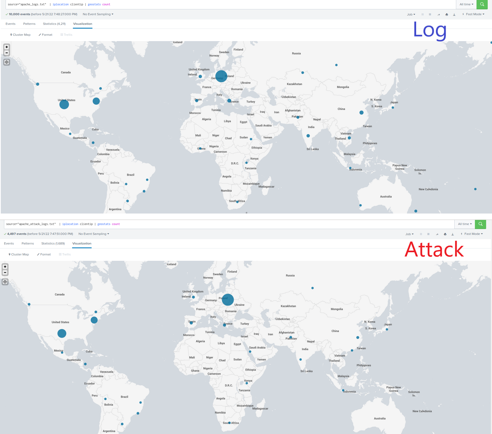

## Unit 19 Homework: Protecting VSI from Future Attacks

### Scenario

In the previous class,  you set up your SOC and monitored attacks from JobeCorp. Now, you will need to design mitigation strategies to protect VSI from future attacks. 

You are tasked with using your findings from the Master of SOC activity to answer questions about mitigation strategies.

### System Requirements 

You will be using the Splunk app located in the Ubuntu VM.

### Logs

Use the same log files you used during the Master of SOC activity:

- [Windows Logs](resources/windows_server_logs.csv)
- [Windows Attack Logs](resources/windows_server_attack_logs.csv)
- [Apache Webserver Logs](resources/apache_logs.txt	)
- [Apache Webserver Attack Logs](resources/apache_attack_logs.txt	)

---

### Part 1: Windows Server Attack

Note: This is a public-facing windows server that VSI employees access.
 
#### Question 1
- Several users were impacted during the attack on March 25th.
- Based on the attack signatures, what mitigations would you recommend to protect each user account? Provide global mitigations that the whole company can use and individual mitigations that are specific to each user.
  - ***user_a was the most impacted by the attack on March 25th***
  - ***In the future, an alert should be triggered when a threshold of 10 failed attempts has been reached for any user along with locking that account***
  - ***Continue to monitor which account is being impacted the most and ensure that they get more training on protecting their account***
  - ***The attempt to reset the password was much higher than the account lock-out so I would recommend focusing on mitigation strategies that focus on password reset. This includes:***
    - ***giving links for password reset a short period of time so attackers don't have enough time to access the link***
    - ***ensure that password reset link has no PII***
    - ***new password follows a complex password policy***
    - ***request user to invalidate all other existing logged-in sessions***
    - ***password rate limiting such as multiple failed login attempts from the same IP address.***
    - ***password reset links can only be used once***

  
#### Question 2
- VSI has insider information that JobeCorp attempted to target users by sending "Bad Logins" to lock out every user.
- What sort of mitigation could you use to protect against this?
  - ***require all employees to use 2-factor authentication***
  - ***continue to monitor logs for potential brute force attack***
  - ***gradually increase delay in lockout after each attempt in a 24 hour period***
  - ***add Captcha to the login process***
  - ***only allow whitelisted IP addresses to attempt logging in to the accounts***

### Part 2: Apache Webserver Attack:

#### Question 1
- Based on the geographic map, recommend a firewall rule that the networking team should implement.
  - ***Source: 194.105.145.147 and 79.171.127.34***
  - ***Source Port Ranges: Any***
  - ***Destination Port Ranges: Any***
  - ***Protocol: TCP***
  - ***Action: Deny all traffic***

- Provide a "plain english" description of the rule.
 - For example: "Block all incoming HTTP traffic where the source IP comes from the city of Los Angeles."
  - ***Block all incoming HTTP traffic with source IPs from  Kiev, Ukraine and Kharkiv, Ukraine. During the attack, both of these cities in Ukraine had seen an increase in events while other areas had experienced a decrease in events due to the account lockouts.***

- Provide a screen shot of the geographic map that justifies why you created this rule. 

#### Question 2

- VSI has insider information that JobeCorp will launch the same webserver attack but use a different IP each time in order to avoid being stopped by the rule you just created.

- What other rules can you create to protect VSI from attacks against your webserver?
  - Conceive of two more rules in "plain english". 
  - Hint: Look for other fields that indicate the attacker.
    - ***Block any IP addresses with the exact same User Agent after 5 or more consecutive POST request have been made. During the attack, the user agent "Mozilla/4.0 (compatible; MSIE 6.0; Windows NT 5.2; SV1; .NET CLR 2.0.50727987787; InfoPath.1)" was prevalent in 1,296 events. Prior to the attack there were no events associated to this user agent.***

    - ***Block any IP address making a POST request to the login page ("POST /VSI_Account_logon.php HTTP/1.1") after 5 or more consecutive attempts have been made. During the attack, there were 1,296 POST requests made to the login page. Prior to the attack, there was 101 POST requests made to the login page over a 3 day period.***

### Guidelines for your Submission:
  
In a word document, provide the following:
- Answers for all questions.
- Screenshots where indicated

Submit your findings in BootCampSpot!

---

© 2020 Trilogy Education Services, a 2U, Inc. brand. All Rights Reserved.
