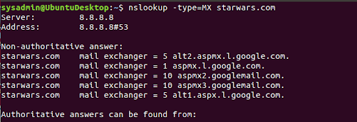
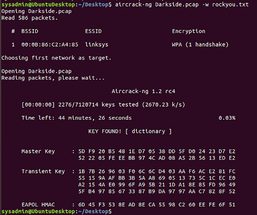
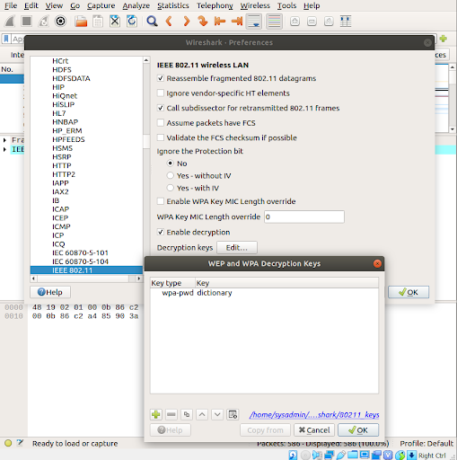
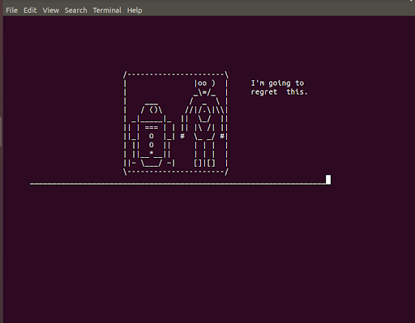

## Networks Fundamentals II Homework: *In a Network Far, Far Away!*

### Background

- You are a Network Jedi working for the Resistance.

- The Sith Empire recently carried out a DoS attack, taking out the Resistance's core network infrastructure, including its DNS servers.

- This attack destroyed the Resistance's ability to communicate via email and retrieve other crucial information about each others' operations. The Empire has taken advantage of this compromised availability by ambushing numerous Resistance outposts, all vulnerable because they can no longer call for help.
 
- Your task is a crucial one: Restore the Resistance's core DNS infrastructure and verify that traffic is routing as expected.

**Good luck and may the Force be with you!**

### Files Required 

-  [Darkside pcap](resources/Darkside.pcap)
-  [Galaxy Network Map](resources/Galaxy_Network_map.png)

### Your Objectives: 

- Review each network issue in the missions below.

- Document each DNS record type found.

- Take note of the DNS records that can explain the reasons for the existing network issue.

- Provide recommended fixes to save the Galaxy!

Submit your results and findings in a document. 

### Topics Covered in Your Assignments

- DNS
- NSLOOKUP
- DNS record types
  - `A`, `PTR`, `MX`, `NS`, `SOA`, `SRV`, `TXT`
- Wireless
  - `WEP`, `WPA`
- Aircrack-ng
- Wireshark Wireless analysis and decryption
  
---

### Mission 1  

**Issue**: Due to the DoS attack, the Empire took down the Resistance's DNS and primary email servers. 

- The Resistance's network team was able to build and deploy a new DNS server and mail server.

- The new primary mail server is `asltx.l.google.com` and the secondary should be `asltx.2.google.com`.

- The Resistance (starwars.com) is able to send emails but unable to receive any.

Your mission:

  - Determine and document the mail servers for starwars.com using NSLOOKUP.
  
  
  - Explain why the Resistance isn't receiving any emails.
    ***Both the primary and secondary mail servers are incorrect***
  - Document what a corrected DNS record should be.
    ***starwars.com        mail exchanger = 1 asltx.l.google.com.***
    ***starwars.com        mail exchanger = 5 asltx.2.google.com.***

### Mission 2

**Issue**: Now that you've addressed the mail servers, all emails are coming through. However, users are still reporting that they haven't received mail from the `theforce.net` alert bulletins.

- Many of the alert bulletins are being blocked or going into spam folders.

- This is probably due to the fact that `theforce.net` changed the IP address of their mail server to `45.23.176.21` while your network was down.

- These alerts are critical to identify pending attacks from the Empire.

Your mission:

  - Determine and document the `SPF` for `theforce.net` using NSLOOKUP.
  

  - Explain why the Force's emails are going to spam.
    ***IP address 45.23.176.21 is not recognized as a trusted sender or receiver***
  - Document what a corrected DNS record should be.
    ***theforce.net	 text = "v=spf1 a mx mx:smtp.secureserver.net include:aspmx.googlemail.com ip4:104.156.250.80 ip4:45.63.15.159 ip4:45.63.4.215 ip4:45.23.176.21"***

### Mission 3

**Issue**: You have successfully resolved all email issues and the resistance can now receive alert bulletins. However, the Resistance is unable to easily read the details of alert bulletins online. 
  
  - They are supposed to be automatically redirected from their sub page of `resistance.theforce.net`  to `theforce.net`.

Your mission:
  
  - Document how a CNAME should look by viewing the CNAME of `www.theforce.net` using NSLOOKUP.
    

  - Explain why the sub page of `resistance.theforce.net` isn't redirecting to `theforce.net`.
    ***A reference from resistance.theforce.net to theforce.net is missing in the DNS CNAME record***
  - Document what a corrected DNS record should be.
    ***www.theforce.net           canonical name = theforce.net.***
    ***resistance.theforce.net    canonical name = theforce.net.***

  
### Mission 4

**Issue**: During the attack, it was determined that the Empire also took down the primary DNS server of `princessleia.site`. 

- Fortunately, the DNS server for `princessleia.site` is backed up and functioning. 

- However, the Resistance was unable to access this important site during the attacks and now they need you to prevent this from happening again.

- The Resistance's networking team provided you with a backup DNS server of: `ns2.galaxybackup.com`.

 Your mission:

  - Confirm the DNS records for `princessleia.site`.
    

  - Document how you would fix the DNS record to prevent this issue from happening again.
    ***princessleia.site    ns2.galaxybackup.com.***
  
### Mission 5

**Issue**: The network traffic from the planet of `Batuu` to the planet of  `Jedha` is very slow.  

- You have been provided a network map with a list of planets connected between `Batuu` and `Jedha`.

- It has been determined that the slowness is due to the Empire attacking `Planet N`.

Your Mission: 

- View the [Galaxy Network Map](resources/Galaxy_Network_map.png) and determine the `OSPF` shortest path from `Batuu` to `Jedha`.

- Confirm your path doesn't include `Planet N` in its route.

- Document this shortest path so it can be used by the Resistance to develop a static route to improve the traffic.
  ***Batuu - Planet D - Planet C - Planet E - Planet F - Planet J - Planet I - Planet L - Planet Q - Planet T - Planet V - Jedha***
  ***Total Hops: 23***

### Mission 6

**Issue:** Due to all these attacks, the Resistance is determined to seek revenge for the damage the Empire has caused. 

- You are tasked with gathering secret information from the Dark Side network servers that can be used to launch network attacks against the Empire.

- You have captured some of the Dark Side's encrypted wireless internet traffic in the following pcap: [Darkside.pcap](resources/Darkside.pcap).

Your Mission:

- Figure out the Dark Side's secret wireless key by using Aircrack-ng.

  - Hint: This is a more challenging encrypted wireless traffic using WPA.

  - In order to decrypt, you will need to use a wordlist (-w) such as `rockyou.txt`.
  

- Use the Dark Side's key to decrypt the wireless traffic in Wireshark.

  - Hint: The format for they key to decrypt wireless is `<Wireless_key>:<SSID>`.
  

- Once you have decrypted the traffic, figure out the following Dark Side information:

  - Host IP Addresses and MAC Addresses by looking at the decrypted `ARP` traffic.

  - Document these IP and MAC Addresses, as the resistance will use these IP addresses to launch a retaliatory attack.
    ***Host IP Address: 172.16.0.101***
    ***Host MAC Address: 00:13:ce:55:98:ef***
    ***Destination IP Address: 172.16.0.1***
    ***Destination MAC Address: 00:0f:66:e3:e4:01***

### Mission 7 

As a thank you for saving the galaxy, the Resistance wants to send you a secret message!

Your Mission:

  - View the DNS record from Mission #4.

  - The Resistance provided you with a hidden message in the `TXT` record, with several steps to follow.
  
  - Follow the steps from the `TXT` record.
    - **Note**: A backup option is provided in the TXT record (as a website) in case the main telnet site is unavailable
  

  - Take a screen shot of the results.
    
### Conclusion

- Submit your results and findings from every mission.

- Congratulations, you have completed your mission and saved the Galaxy!

---
© 2020 Trilogy Education Services, a 2U, Inc. brand. All Rights Reserved.        
  
